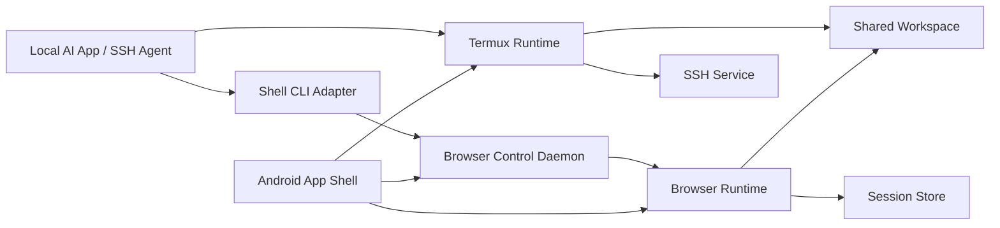

# Android OpenClaw-Style Execution Base Technical Architecture

## 1. Document Status

- Status: Draft v0.1
- Date: 2026-03-22
- Language: zh-CN
- Related PRD: [prd.md](./prd.md)

## 2. Purpose

本文档定义第一阶段的技术架构，用于回答以下问题：

- 如何在 Android 上复用 Termux 级终端能力
- 如何在同一个 App 内提供可编程浏览器能力
- 如何让命令行以接近 OpenClaw 的方式驱动浏览器
- 如何让终端与浏览器共享同一个工作目录与会话状态

本文档不定义：

- AI 模型或 Agent 设计
- 自定义远程协议
- 多标签页浏览器架构

## 3. Architecture Drivers

以下约束直接驱动架构选择：

- 终端能力边界必须等同于 Termux
- 尽量直接复用 Termux 代码
- Termux 包名不改变
- 浏览器控制命令格式尽量兼容 OpenClaw
- 远程 Agent 通过 SSH 接入，不单独设计远程控制协议
- 浏览器与终端必须共享工作目录
- 浏览器必须保留登录态、Cookie、LocalStorage
- 第一阶段不做多标签页、截图、录屏

## 4. High-Level Architecture

第一阶段采用“单宿主 App + 终端运行时 + 浏览器运行时 + 本地命令桥”的结构。



核心思路：

- App 本身是统一宿主，承载终端、浏览器和桥接控制器。
- 终端运行时尽量复用 Termux 现有实现。
- 浏览器运行时嵌入在 App 内部，提供真实可见的浏览器视图。
- 命令行控制不是直接操作 WebView，而是先进入本地控制守护进程，再由守护进程调度浏览器动作。
- 所有文件工作围绕统一工作目录进行。

## 5. Core Design Decisions

### 5.1 Single Host App

第一阶段采用单个 Android App 承载全部能力，而不是把终端和浏览器拆成多个独立 App。原因：

- 共享工作目录更直接
- 浏览器会话持久化更稳定
- 命令桥不需要跨应用权限协商
- UI 上能同时呈现终端和浏览器视图

### 5.2 Termux-as-Core Runtime

终端层不重新实现 shell、包管理、文件布局和 SSH 能力，而是以 Termux 为核心运行时：

- 保留其能力边界
- 保留其包名
- 最大化复用其代码和进程模型

这意味着产品更接近“在 Termux 宿主上加浏览器运行时与控制桥”，而不是“重写一个终端 App”。

### 5.3 Browser Control via Local Daemon

浏览器控制不直接暴露为 Android 内部方法调用，而是通过一个本地守护进程对外提供稳定入口。原因：

- Shell 和 SSH 环境最容易调用命令行工具
- 可以统一本地 AI 与远程 Agent 的调用路径
- 便于把 OpenClaw 风格命令映射为内部动作规范
- 可把 UI 线程和命令执行线程解耦

### 5.4 Persistent Single-Tab Browser

第一阶段采用单标签、长期存活的浏览器运行时。原因：

- 降低状态同步复杂度
- 更容易保留登录态
- 更容易把命令结果和当前页面状态对应起来

## 6. Logical Components

### 6.1 App Shell

职责：

- 承载 Android Activity / Fragment / Compose UI
- 管理浏览器视图和终端视图布局
- 管理应用生命周期
- 启动控制守护进程和相关后台组件

建议模块：

- `app-shell`
- `ui-browser`
- `ui-terminal`

### 6.2 Termux Runtime Layer

职责：

- 提供 shell、包管理、SSH、进程执行能力
- 暴露标准终端环境
- 维护共享工作目录的主文件上下文

要求：

- 尽量原样复用 Termux 核心代码
- 不改变既有能力边界
- 保证 SSH 进入后也能访问浏览器控制 CLI

建议模块：

- `termux-core`
- `termux-shell-integration`

### 6.3 CLI Adapter Layer

职责：

- 接收 OpenClaw 风格命令
- 解析参数
- 组装内部动作请求
- 调用本地控制守护进程
- 输出机器可读结果

形态：

- 一个放入 PATH 的可执行命令
- 本地终端与 SSH 用户使用同一入口

建议模块：

- `browser-cli`

### 6.4 Browser Control Daemon

职责：

- 作为 Shell 世界和 Android UI 世界之间的桥
- 接收 CLI 请求
- 校验运行态是否就绪
- 序列化浏览器动作
- 等待浏览器执行完成
- 返回结构化结果

建议通信：

- 本地 Unix Domain Socket
- 消息格式采用 JSON

原因：

- 终端和 SSH 都容易接入
- 不需要引入 HTTP 服务器
- 作用域天然限定在设备本地

建议模块：

- `browser-daemon`

### 6.5 Browser Runtime

职责：

- 承载用户可见的单标签浏览器
- 执行导航、点击、输入、滚动
- 暴露页面文本、DOM 和控制台错误
- 保持真实浏览状态

MVP 技术路线：

- 采用单实例、持久化的 `WebView` 运行时

原因：

- Android 集成成本最低
- UI 与生命周期管理最直接
- Cookie / LocalStorage 持久化路径成熟

后续替换路径：

- 如果 OpenClaw 兼容性受限，可评估更重的 Chromium 嵌入方案

建议模块：

- `browser-runtime`
- `browser-automation`

### 6.6 Workspace Manager

职责：

- 定义共享工作目录根路径
- 协调终端与浏览器的文件访问
- 处理上传和下载文件桥接

建议模块：

- `workspace`

### 6.7 Session Store

职责：

- 管理 Cookie 持久化
- 管理 LocalStorage 持久化
- 管理页面状态恢复

建议模块：

- `session-store`

## 7. Runtime Topology

第一阶段建议运行拓扑如下：

- Android 主进程：承载 App Shell、Browser Runtime、Browser Control Daemon
- Termux 进程体系：承载 shell、命令执行、SSH 会话
- WebView JS 执行环境：承载页面脚本和自动化注入脚本

设计原则：

- 浏览器控制必须在主进程内可控
- Shell 进程不直接持有 UI 对象
- 所有浏览器动作都通过守护进程串行化，避免并发破坏页面状态

## 8. Command Path

### 8.1 Local AI Path

1. 本机 AI 在终端中执行 `browser-cli` 命令。
2. CLI 解析命令并发送 JSON 请求到本地 socket。
3. 守护进程接收请求并生成内部 `ActionSpec`。
4. 浏览器运行时在 UI 线程执行动作。
5. 结果返回给守护进程。
6. 守护进程把结果格式化后回传给 CLI。
7. CLI 将结果输出到 stdout，并通过 exit code 表达执行状态。

### 8.2 SSH Path

1. 远程 Agent 通过 SSH 进入 Termux 环境。
2. Agent 执行同一个 `browser-cli` 命令。
3. 后续路径与本地一致。

这样可以保证：

- 本地和远程调用完全复用一套能力面
- 不需要定义第二套 API

## 9. Command Model

第一阶段内部统一动作对象：

```json
{
  "action": "click",
  "target": {
    "selector": "button.submit"
  },
  "options": {
    "timeoutMs": 5000
  }
}
```

CLI 负责把 OpenClaw 风格命令映射到统一 `ActionSpec`。这样做的目的：

- 对外兼容命令风格
- 对内统一调度模型
- 降低浏览器运行时与命令解析层的耦合

第一阶段建议支持的动作类型：

- `open`
- `click`
- `type`
- `scroll`
- `read_text`
- `read_dom`
- `read_console`

建议输出格式：

```json
{
  "ok": true,
  "action": "read_text",
  "url": "http://127.0.0.1:3000",
  "result": {
    "text": "Hello world"
  }
}
```

错误返回建议：

```json
{
  "ok": false,
  "action": "click",
  "error": {
    "code": "ELEMENT_NOT_FOUND",
    "message": "No element matched selector: button.submit"
  }
}
```

## 10. Browser Automation Strategy

### 10.1 Navigation

- 使用浏览器运行时统一管理当前 URL
- 导航完成后返回最终 URL、标题和加载状态

### 10.2 Element Interaction

第一阶段元素定位以简单稳定为优先，建议支持：

- CSS selector
- XPath
- 文本匹配

内部实现上，将定位逻辑转为页面脚本注入执行。

### 10.3 Typing

- 定位输入元素
- 聚焦目标元素
- 设置值并触发必要事件

### 10.4 Scrolling

- 支持页面级滚动
- 支持按元素滚动作为后续扩展点

### 10.5 Read Text / DOM

- 通过 `evaluateJavascript` 执行读取脚本
- 返回页面可见文本或 DOM 字符串

### 10.6 Console Error Collection

- 通过 `WebChromeClient` 采集 console 消息
- 第一阶段以错误级日志为核心
- 守护进程提供最近一次或最近 N 条错误输出

## 11. Browser Runtime Choice

### 11.1 MVP Choice: WebView

MVP 采用 `WebView`，原因：

- Android 原生嵌入简单
- 生命周期管理明确
- 会话持久化成熟
- 与文件上传/下载打通较直接

### 11.2 Known Tradeoffs

- 与桌面浏览器行为不完全等价
- 某些高级自动化能力可能比桌面 Chromium 更受限
- OpenClaw 全量兼容可能需要后续适配层补偿

结论：

- MVP 先以 `WebView` 跑通统一宿主
- 若后续发现关键命令无法可靠兼容，再评估浏览器内核升级

## 12. Shared Workspace Design

### 12.1 Workspace Root

共享工作目录应直接建立在 Termux 主工作目录体系内，使终端天然可见，浏览器通过桥接访问同一路径。

建议原则：

- 对终端而言这是默认工作目录之一
- 对浏览器上传/下载而言这是默认文件根
- 对 Agent 而言这是项目主目录

### 12.2 Upload Flow

1. 网页触发文件选择。
2. 浏览器文件选择器优先落到共享工作目录。
3. 用户或自动化动作从共享目录选取文件。

实现重点：

- 自定义 `WebChromeClient#onShowFileChooser`
- 文件来源优先映射到共享目录

### 12.3 Download Flow

1. 页面触发下载。
2. 下载处理器接管请求。
3. 文件写入共享工作目录。
4. 终端立即可见该文件。

实现重点：

- 自定义下载监听器
- 下载完成后更新目录索引或通知终端层

## 13. Session Persistence Design

必须持久化的会话资产：

- Cookie
- LocalStorage
- 浏览器当前状态

第一阶段策略：

- 复用 WebView 默认持久化机制
- App 启动时恢复持久化浏览器实例或恢复上一页面上下文
- 不在 MVP 里实现多 profile 管理

## 14. UI Architecture

第一阶段采用双视图布局：

- 浏览器视图
- 终端视图

建议布局策略：

- 手机竖屏下支持浏览器/终端切换或上下分区
- 横屏下可支持更明显的并排视图

注意：

- UI 不是命令入口的唯一形态
- 即使用户不直接操作终端，终端视图仍然有必要保留，用于可见性和调试

## 15. Process Communication

### 15.1 Recommended IPC

第一阶段推荐使用本地 Unix Domain Socket。

原因：

- Shell 友好
- SSH 友好
- 开销小
- 不暴露公网接口

### 15.2 Message Shape

通信建议采用：

- 单请求单响应
- JSON 编码
- 明确 request id

示例：

```json
{
  "id": "req_123",
  "action": "open",
  "params": {
    "url": "https://example.com"
  }
}
```

## 16. Failure Model

第一阶段需要统一的失败语义，避免 Agent 难以恢复。

建议错误码：

- `BROWSER_NOT_READY`
- `INVALID_ARGUMENT`
- `NAVIGATION_FAILED`
- `ELEMENT_NOT_FOUND`
- `SCRIPT_EXECUTION_FAILED`
- `CONSOLE_LOG_UNAVAILABLE`
- `WORKSPACE_IO_ERROR`
- `TIMEOUT`

设计要求：

- CLI 必须返回非零 exit code
- stderr 可以给人看
- stdout 保持机器可读 JSON 为主

## 17. Observability

第一阶段至少应具备：

- CLI 调用日志
- 守护进程请求日志
- 浏览器导航日志
- 控制台错误缓存
- 下载/上传桥接日志

日志目标：

- 便于 Agent 判断失败原因
- 便于本地调试
- 便于兼容性回归

## 18. Compatibility Strategy

### 18.1 Termux Compatibility

策略：

- 不重新定义 shell 行为
- 不缩小能力边界
- 尽量把浏览器能力作为附加层接入，而不是改写 Termux 基础模型

### 18.2 OpenClaw Compatibility

策略：

- 先兼容核心命令子集
- 参数命名尽量保持一致
- 返回结构若有差异，应提供兼容模式或文档说明

建议第一阶段输出一份兼容矩阵，逐项记录：

- 命令名
- 参数
- Android 差异
- 已支持/部分支持/不支持

## 19. Proposed Module Breakdown

建议仓库模块结构：

- `docs/`
- `app-shell/`
- `termux-core/`
- `browser-runtime/`
- `browser-daemon/`
- `browser-cli/`
- `workspace/`
- `session-store/`

如果第一阶段不拆多模块仓库，至少在代码目录中保持上述逻辑分层。

## 20. Implementation Sequence

### Phase 0: Feasibility Spike

- 验证保留 Termux 包名的前提下是否能嵌入浏览器视图
- 验证 shell 侧能否稳定调用本地 socket
- 验证 WebView 是否足以完成核心自动化动作

### Phase 1: Host Skeleton

- 建立 App Shell
- 跑通终端视图和浏览器视图
- 建立共享工作目录

### Phase 2: Command Bridge

- 实现 CLI
- 实现守护进程
- 跑通 `open`、`click`、`type`

### Phase 3: Read and Diagnose

- 实现 `scroll`
- 实现 `read_text`
- 实现 `read_dom`
- 实现 `read_console`

### Phase 4: Workspace and Session

- 打通上传
- 打通下载
- 验证 Cookie / LocalStorage 持久化
- 验证本地开发预览工作流

### Phase 5: Compatibility Hardening

- 补齐 OpenClaw 兼容矩阵
- 修复稳定性问题
- 收口 MVP 发布文档

## 21. Key Technical Risks

- “包名不改变”可能限制与官方 Termux 的共存方式，需要尽早验证安装与升级路径
- WebView 的行为差异可能导致部分 OpenClaw 命令只能部分兼容
- 文件上传下载桥接可能受 Android 文件权限和 URI 模型影响
- 如果浏览器实例被系统回收，会直接影响登录态连续性和命令可靠性

## 22. Open Questions

仍需后续定版的问题：

- OpenClaw 需要对齐到哪个命令版本
- CLI 是否需要同步提供纯文本输出模式，还是默认只保留 JSON 模式
- 终端与浏览器 UI 在竖屏手机上的默认交互方式
- 如果 WebView 无法覆盖关键命令，升级到更重浏览器内核的触发条件

## 23. Immediate Next Documents

在本架构文档之后，建议优先补：

- OpenClaw 命令接口规范
- Feasibility Spike 任务清单
- 共享工作目录与文件桥接详细设计
